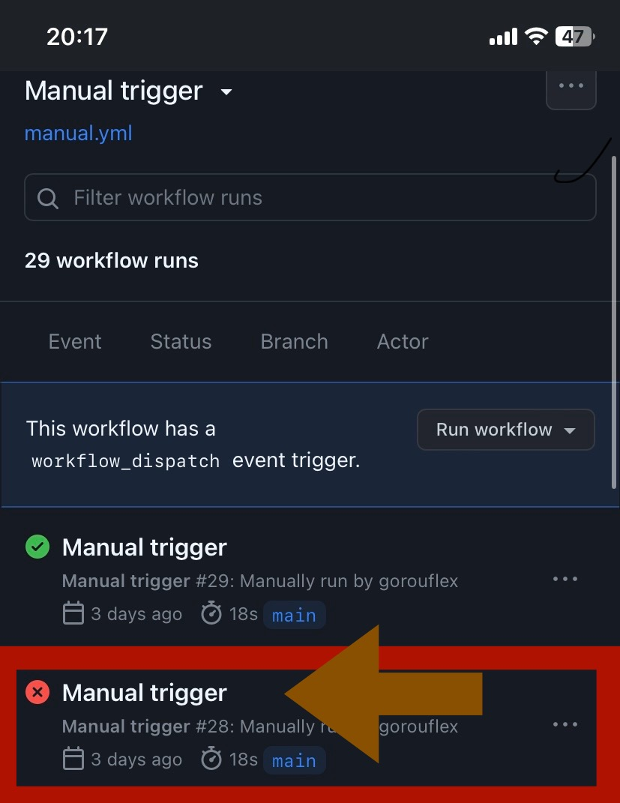
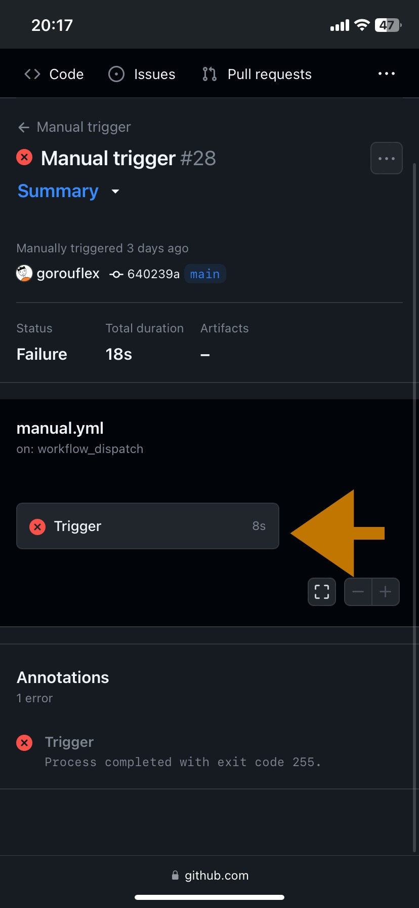
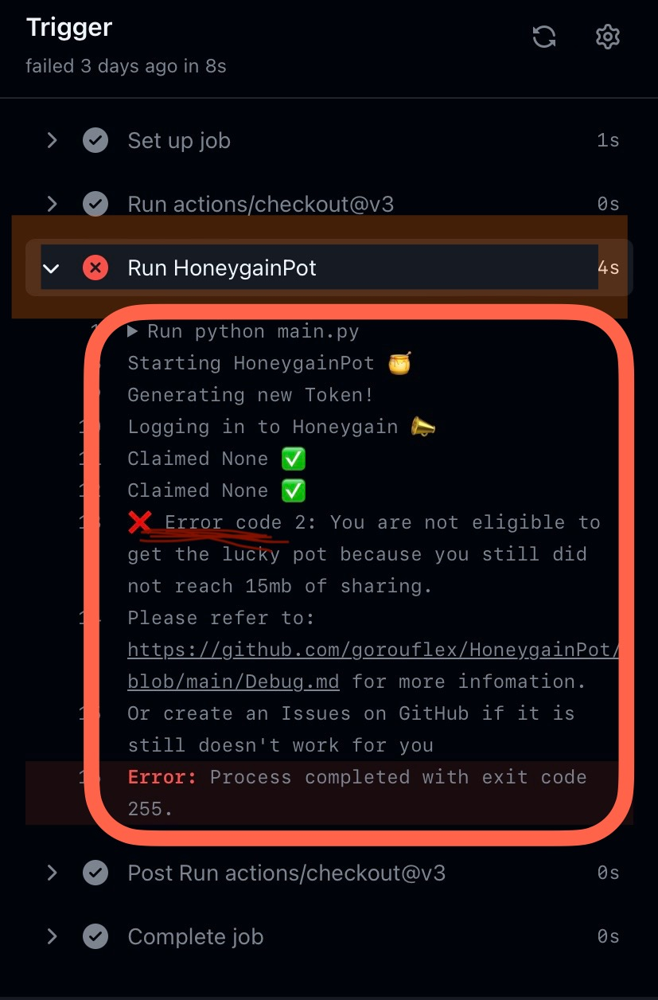

<h1 align="center">Debug</h1>

# How to get debug logs?
1. Go Actions tab
2. Click to the failure task
3. Then click to `Trigger` or `Daily` tab then click to the `Run HoneygainPot` section, you will see the debug logs

<p align="left">
  
</p>
<p align="center">
  
</p>
<p align="right">
  
</p>
  
## GitHub Actions

### Error code 1
```
Logging in to Honeygain!
Traceback (most recent call last):
  File "/home/runner/work/HoneygainPot/HoneygainPot/main.py", line 280, in <module>
    main()
  File "/home/runner/work/HoneygainPot/HoneygainPot/main.py", line 243, in main
    if not achievements_claim(s):
  File "/home/runner/work/HoneygainPot/HoneygainPot/main.py", line 199, in achievements_claim
    achievements: dict = achievements.json()
  File "/usr/lib/python3/dist-packages/requests/models.py", line 900, in json
    return complexjson.loads(self.text, **kwargs)
  File "/usr/lib/python3.10/json/__init__.py", line 346, in loads
    return _default_decoder.decode(s)
  File "/usr/lib/python3.10/json/decoder.py", line 337, in decode
    obj, end = self.raw_decode(s, idx=_w(s, 0).end())
  File "/usr/lib/python3.10/json/decoder.py", line 355, in raw_decode
    raise JSONDecodeError("Expecting value", s, err.value) from None
json.decoder.JSONDecodeError: Expecting value: line 1 column 1 (char 0)
Error: Process completed with exit code 1.

```

or

```
Error code 1: Cannot find 'MAIL_JWD' and 'PASS_JWD' 
```
- Solution : This means you did not set `MAIL_JWD` and `PASS_JWD` secrets in the GitHub repo settings

### Error code 2

```
Error code 2: You are not eligible to get the lucky pot
```

or

```
Claimed None.
Traceback (most recent call last):
  File "/home/runner/work/HoneygainPot/HoneygainPot/main.py", line 281, in <module>
    main()
  File "/home/runner/work/HoneygainPot/HoneygainPot/main.py", line 263, in main
    print(f'Claimed {pot_claim["data"]["credits"]} Credits.')
KeyError: 'data'

```

- Solution : You are not eligible to get the lucky pot if you do not reach 15mb of sharing

### Error code 3

```
Error code 3: Cannot receive any input, make sure 'IsGit' = 1
```

or


```
Generating new Config!
Traceback (most recent call last):
  File "/home/runner/work/HoneygainAutoClaim/HoneygainAutoClaim/main.py", line 113, in <module>
    create_config()
  File "/home/runner/work/HoneygainAutoClaim/HoneygainAutoClaim/main.py", line 40, in create_config
    email: str = input("Email: ")
EOFError: EOF when reading a line
Email: 

```

- Solution : This is because GitHub Actions is basically a non-input console, so the code cannot receive the input, make sure that `IsGit` is set to 1 in the workflows file `daily.yml`


### Error code 4

```
Error code 4: Wrong login credentials,please enter the right ones
```

- Solution : Check your credenrials again
