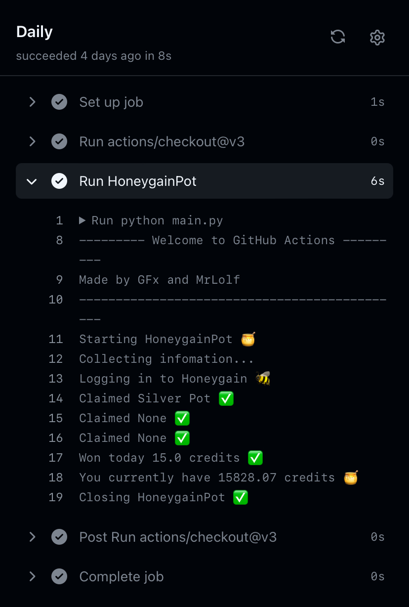

<h1 align="center">Honeygain Pot</h1>
<h4 align="center">🐝Ein Bot, der jeden Tag den Honeygain Pot beansprucht🍯</h4>
<h4 align="center">Angetrieben von GitHub Actions und Python</h4>
<p align="center">

 (*)
<p align="center">
  <a href="https://github.com/gorouflex/HoneygainPot/">English 🇺🇸</a>
  •
  <a href="README-vn.md">Tiếng Việt 🇻🇳</a>
  •
  <a href="README-fr.md">Français 🇫🇷</a>
  •
  <a href="README-de.md">Deutsch 🇩🇪</a>
<p align="center">
  <a href="Debug.md">Debuggen</a>     
  •
  <a href="#funktionen">Funktionen</a>
  •
  <a href="#Nutzung">Nutzung</a> 
  •
  <a href="#vorschau">Vorschau</a>
</p>
 <p align="left">
   
</p>
    
> [!NOTE]
> English: This is not a 100% accurate translation for Deutsch
> - Aktualisieren Sie Ihr Repository immer gemäß dem Original-Repository, um die neuesten Updates + Bugfixes zu erhalten. Ich werde keine Unterstützung bieten, wenn Ihr Repository veraltet ist.
> - Wenn Sie bei der Verwendung von GitHub Actions auf Fehler stoßen, beziehen Sie sich bitte auf diesen [Debug-Bereich](Debug.md)
> - (*): Forken Sie dieses Repo nicht, wenn zwei dieser (nicht nur 1) GitHub Actions-Statussymbole einen Fehler zeigen, und warten Sie, bis 1 oder beide davon korrekt angezeigt werden, bevor Sie erneut forken.
> - Der Workflow `Daily claim` wird immer um 14:00 Uhr UTC +0 ausgeführt. Wenn Sie dies ändern möchten, lesen Sie [dies](https://github.com/gorouflex/HoneygainPot/blob/main/README-de.md#wie-%C3%A4ndere-ich-den-zeitplan-um-zu-meiner-zeitzone-zu-passen-bevor-der-pot-zur%C3%BCckgesetzt-wird)
> 
  
# Funktionen 

- Den Honeygain Pot und Belohnungen für Erfolge jeden Tag mit GitHub Actions beanspruchen 🔥
- Überprüfung Ihres aktuellen Guthabens

# Nutzung 

  1. [Forken Sie dieses Repository](https://github.com/gorouflex/HoneygainPot/fork)
  2. Gehen Sie zu Ihrem geforkten Repository
  3. Gehen Sie zu `Settings > Secrets and Variables > Actions`. Und klicken Sie auf die Schaltfläche `New Repository Secret`
  4. Verwenden Sie für den Secret-Namen `MAIL_JWD`, um Ihre Honeygain-E-Mail und `PASS_JWD` für Ihr Passwort festzulegen.
  5. Gehen Sie zu Ihrem geforkten Repository und wechseln Sie zum Tab Aktionen und klicken Sie auf die Schaltfläche `I understand my workflows, go ahead and enable them`


## Wie ändere ich den Zeitplan, um zu meiner Zeitzone zu passen, bevor der Pot zurückgesetzt wird?

> [!IMPORTANT]
Dateipfad für tägliche Workflows (Standard ist 14:00 Uhr UTC +0): `.github/workflows/daily.yml`

Nun, GitHub verwendet UTC-Zeit (UTC +0) für die Planung von Workflows, daher sollten wir es in unsere Zeitzone umrechnen.

Beispiel: Wenn ich den täglichen Auslöser auf 21:00 Uhr (UTC +7) einstellen möchte, muss ich ihn auf 14:00 Uhr oder 14:00 Uhr (24-Stunden-Format) (UTC±0) einstellen (2+7=9).

```
name: Daily claim
on:
  schedule:
    - cron: '0 14 * * *' # <- UTC-Zeit, ersetzen Sie 0 14
```
Also, wenn ich den täglichen Auslöser um 5:00 Uhr morgens (UTC +7) laufen lassen möchte, muss ich ihn auf 22:00 Uhr (UTC±0) (im 24-Stunden-Format) einstellen:
```
name: Daily claim
on:
  schedule:
    - cron: '0 22 * * *' # UTC-Zeit
```

> [!NOTE]
> GitHub Actions-Zeitpläne können aufgrund hoher Nachfrage manchmal um bis zu 15 Minuten verzögert sein, also keine Sorge!

# Vorschau

<p align="center">
  
  
</p>

## Dank an
- [MrLolf](https://github.com/MrLoLf/) für [HoneygainAutoClaim](https://github.com/MrLoLf/HoneygainAutoClaim)
- [rfoal](https://github.com/rfoel/) x [duolingo](https://github.com/rfoel/duolingo) für die Idee
